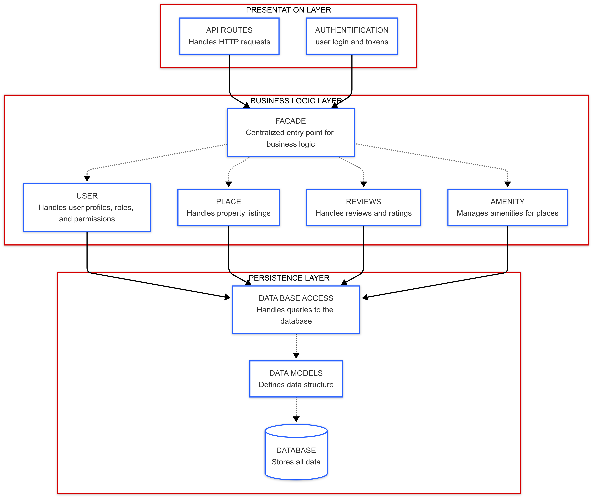
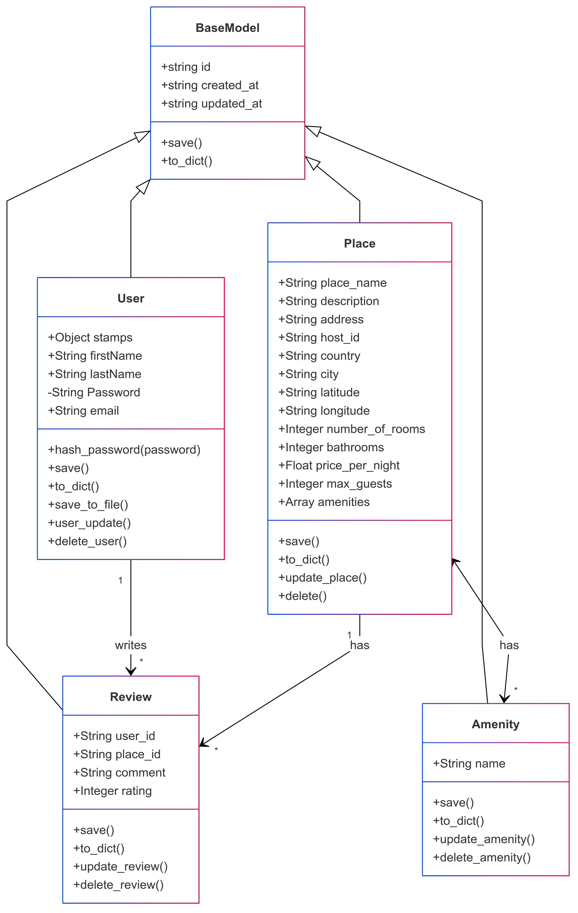
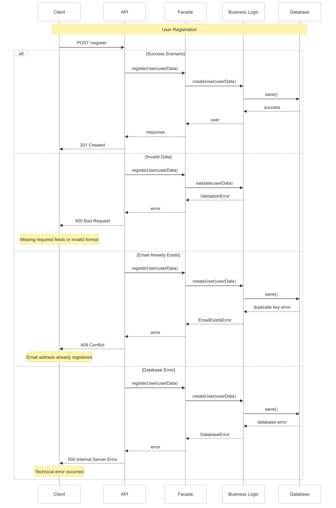
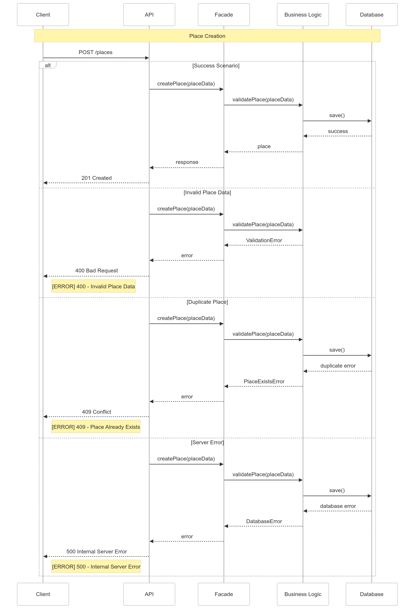
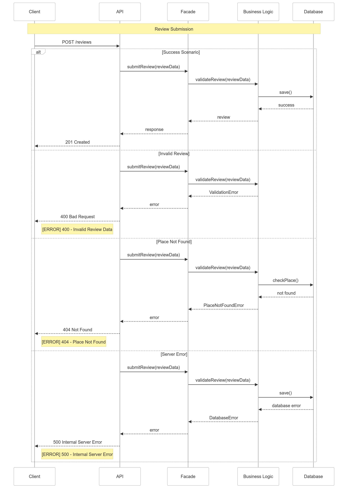
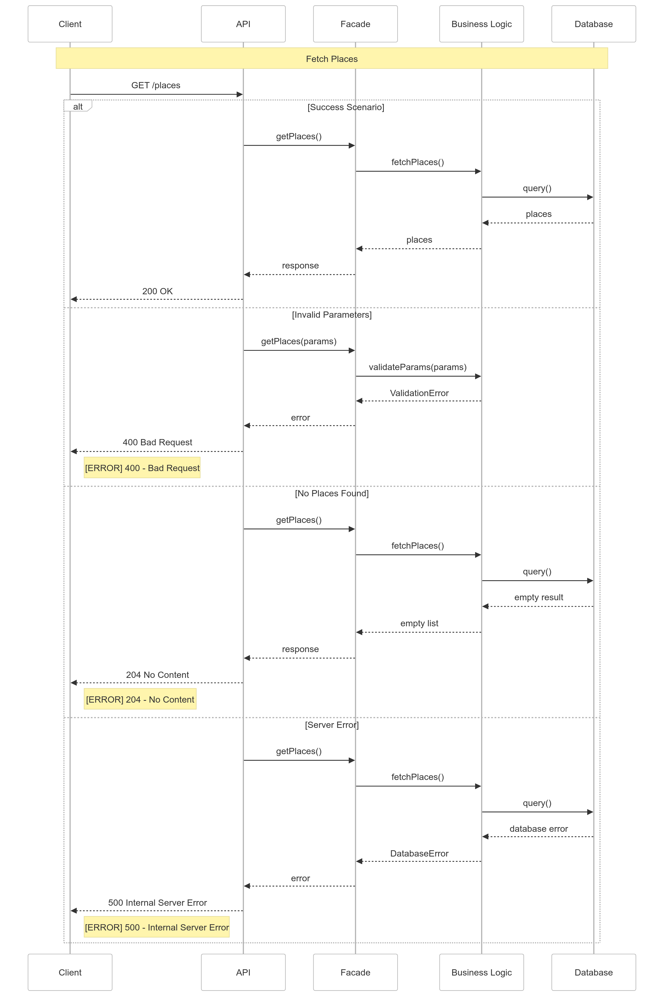

# HBnB Technical Documentation

## 1. Introduction

[Section Introduction inchangée...]

## 2. System Architecture

### 2.1 Overview

The system follows a layered architecture pattern with clear separation of concerns:

[Description des couches inchangée...]

### 2.2 High-Level Architecture Diagram

*Figure 1: High-level architecture showing the layered design pattern with Presentation, Business Logic, and Persistence layers.*

Key components shown in the diagram:
- Presentation Layer: API Routes and Authentication
- Business Logic Layer: Facade pattern and domain services
- Persistence Layer: Database access and data models

### 2.3 Key Design Patterns

[Section Design Patterns inchangée...]

## 3. Domain Models

### 3.1 Class Diagram

*Figure 2: Detailed class diagram showing the relationships between core entities.*

The class diagram above illustrates:
- BaseModel as the parent class
- Core entities: User, Place, Review, and Amenity
- Relationships and cardinality between entities
- Properties and methods for each class

### 3.2 Core Entities

#### BaseModel
- Base class for all entities
- Properties:
  - id: UUID primary key
  - created_at: Timestamp of creation
  - updated_at: Timestamp of last update
- Methods:
  - save(): Updates the updated_at timestamp
  - to_dict(): Converts object to dictionary format

#### User
- Represents a user in the system
- Properties:
  - email: User's email address (unique)
  - password: Hashed password
  - first_name: User's first name
  - last_name: User's last name
- Relationships:
  - Has many Places
  - Has many Reviews

#### Place
- Represents a rental property
- Properties:
  - name: Name of the place
  - description: Detailed description
  - price_per_night: Rental price
  - latitude: Geographic coordinate
  - longitude: Geographic coordinate
- Relationships:
  - Belongs to one User (owner)
  - Has many Reviews
  - Has many Amenities

## 4. API Endpoints and Flow

### 4.1 Place Operations

#### GET /places

*Figure 3: Sequence diagram showing the flow of GET /places request.*

The diagram illustrates:
- Success scenario (200 OK)
- Error handling for invalid parameters (400)
- No content scenario (204)
- Server error handling (500)

#### POST /places

*Figure 4: Sequence diagram showing the flow of POST /places request.*

Key interactions shown:
- Validation flow
- Success creation path
- Duplicate handling
- Error scenarios

### 4.2 Review Operations

#### POST /reviews

*Figure 5: Sequence diagram showing the flow of POST /reviews request.*

The diagram details:
- Review submission process
- Validation steps
- Success and error paths
- Database interactions

### 4.3 User Registration

*Figure 6: Sequence diagram showing the user registration flow.*

The diagram shows:
- Registration process
- Data validation
- Email uniqueness check
- Error handling scenarios
